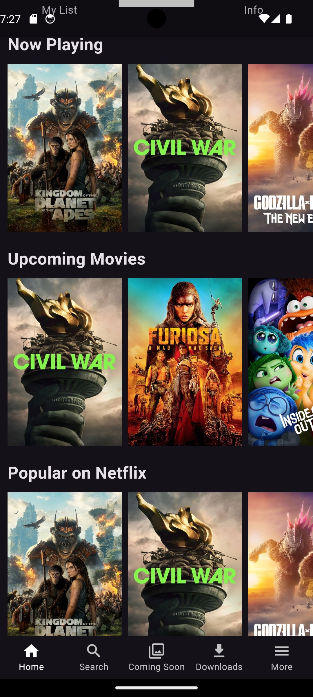

<h1>Netflix Clone</h1>

A Netflix Clone App Build With Flutter Using The TMDB API!

<h2>Highlights:</h2>

Modern UI/UX , TMDB API Integration , Responsive Design , Search Functionality

 
<h2>Technical Insights:</h2>

Flutter & Dart , Bloc State Management , HTTP Package , Error Handling

<h2>ScreenShots</h2>

